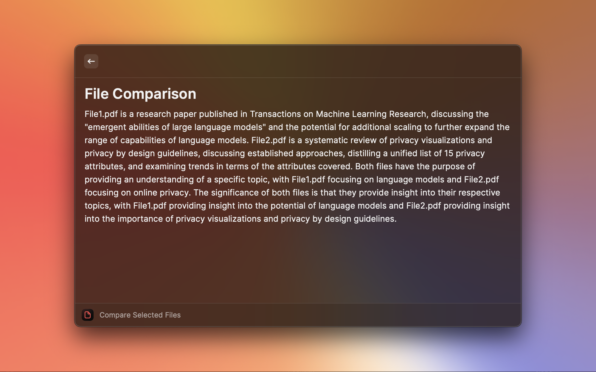

# File AI

A Raycast extension for identifying, summarizing, and comparing selected files using Raycast AI.

## Commands

- Summarize Selected Files
    - Summarize the contents of selected text files, PDFs, images, audio files, and more.
- Compare Selected Files
    - Compare and contrast the contents of selected files.
- Assess Overlap
    - Assess the overlap in ideas between the contents of two or more selected files.
- Identify Purpose
    - Get a quick overview of the purpose and usage of a file.
- Summarize Spoken Audio
    - Summarize the spoken word content of audio files.

## Images

